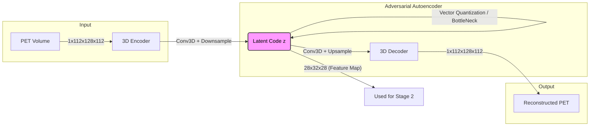
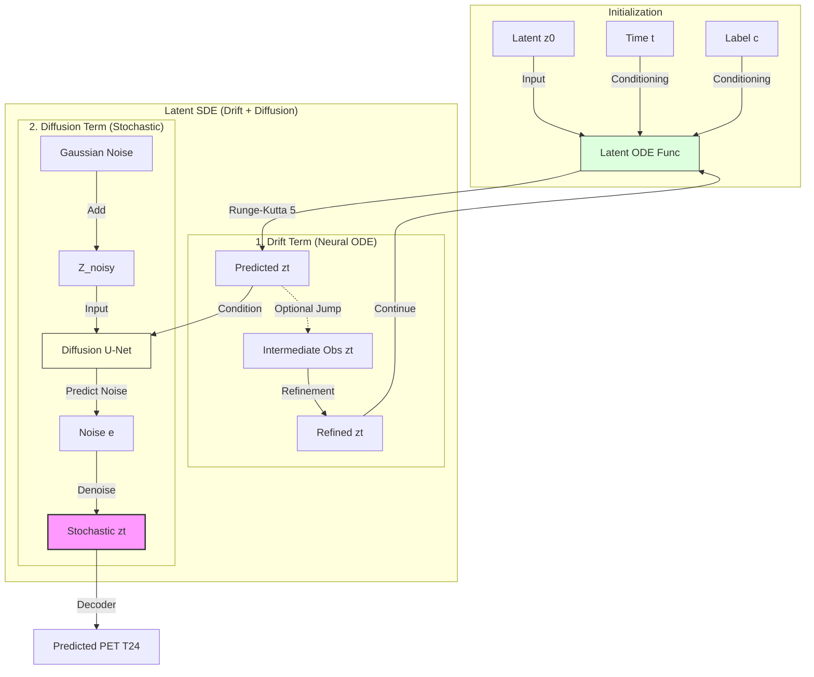

# Longitudinal PET Prediction with Neural ODE

[](https://www.python.org/)
[](https://pytorch.org/)
[](https://opensource.org/licenses/MIT)

> **Predict future PET scans from baseline using Neural ODEs, with robust handling of missing intermediate timepoints.**

---

## 📖 Overview

Predicting the progression of Alzheimer's Disease (AD) via longitudinal PET scans is critical for early diagnosis and treatment planning. This project implements a **Neural Ordinary Differential Equation (Neural ODE)** framework to predict future PET scans (e.g., at Month 24) from a baseline scan (Month 0).

A key challenge in longitudinal medical imaging is **missing data**. Patients often miss intermediate checkups (e.g., at Month 6, 12, or 18). Our model leverages the continuous-time modeling capabilities of Neural ODEs to naturally handle these irregular time intervals, integrating whatever data is available to refine the prediction trajectory.

### Key Features

- **Neural ODE**: Continuous-time dynamics modeling in latent space (Drift term)
- **Latent SDE**: Stochastic Differential Equation modeling (Drift + Diffusion)
- **Missing Data Handling**: Robust to variable available timepoints per subject
- **Disease Conditioning**: Optional conditioning on disease stage labels

### Architecture

#### Stage 1: Latent Representation Learning (AAE)
3D Adversarial Autoencoder compresses high-dimensional PET scans into a compact latent space.



#### Stage 2: Longitudinal Dynamics (Latent SDE)
Modeling the temporal evolution $z_0 	o z_{24}$ using Stochastic Differential Equations.



### Technical Details

#### 1. Network Architecture

The core of the system is the **Latent ODE Function** ($f(z,t)$), which parameterizes the time derivative of the latent state.

*   **Input**: Latent state $z_t \in \mathbb{R}^{C \times D \times H \times W}$ (typically $1 \times 28 \times 32 \times 28$) and time $t$.
*   **Backbone**: A lightweight **3D U-Net** operating in latent space.
    *   **Encoder**: 3 blocks of `Conv3D` -> `GroupNorm` -> `Swish` -> `Conv3D` with residual connections.
    *   **Time Conditioning**: Sinusoidal time embeddings projected via MLP and injected into each block (shift/scale).
    *   **Disease Conditioning**: Learnable class embeddings added to time embeddings.
    *   **Decoder**: Symmetric path with concatenation skip connections from the encoder.
*   **Output**: Derivative $dz/dt$ of the same shape as input.

#### 2. Jump ODE for Missing Data

We employ a **Jump Neural ODE** framework to robustly handle missing intermediate data without imputation.

*   **Mechanism**: The solver integrates the trajectory from $T_{prev}$ to $T_{curr}$.
*   **Observation Update**: If a real PET scan exists at $T_{curr}$ (e.g., Month 6):
    1.  The model predicts $\hat{z}_{curr}$ from the ODE integration.
    2.  The observation encoder processes the concatenation of prediction and real data: $\delta = E(\text{cat}(\hat{z}_{curr}, z_{obs}))$.
    3.  The state "jumps" to a refined position: $z_{new} = \hat{z}_{curr} + \delta$.
    4.  Integration continues from $z_{new}$.
*   **Universal Support**: This logic is built into both `LatentODE` and `LatentSDE`. It automatically activates whenever intermediate data is passed to the forward pass.

#### 3. ODE Solver & Optimization

*   **Solver**: `dopri5` (Dormand-Prince), an adaptive step-size Runge-Kutta method (order 5).
    *   *Why?* Balances speed and accuracy. Adaptive steps allow it to slow down for complex dynamics.
*   **Adjoint Method**: Trained using `odeint_adjoint` for constant memory cost $O(1)$ with respect to integration time, enabling deeper temporal modeling without running out of GPU memory.
*   **Latent SDE**: Combines the determinstic drift ($f$) above with a diffusion process ($g$).
    *   Drift: Neural ODE ($\mu_\theta$)
    *   Diffusion: 3D U-Net ($\epsilon_\theta$) predicting noise for stochastic refinement.

## Installation

```bash
# Clone repository
git clone https://github.com/avalanchezy/IL-CLDM.git
cd IL-CLDM

# Create environment
conda create -n pet-ode python=3.11
conda activate pet-ode

# Install PyTorch (adjust for your CUDA version)
pip install torch torchvision torchaudio --index-url https://download.pytorch.org/whl/cu121

# Install dependencies
pip install -r requirements.txt
```

## Data Preparation

### Directory Structure

```
IL-CLDM/
├── data/
│   └── {SubjectID}/
│       ├── *_ses-M00_*_pet.nii.gz    # Baseline (required)
│       ├── *_ses-M06_*_pet.nii.gz    # Month 6 (optional)
│       ├── *_ses-M12_*_pet.nii.gz    # Month 12 (optional)
│       └── *_ses-M24_*_pet.nii.gz    # Target (required)
├── data_info/
│   ├── data_info.csv                 # Labels: filename,label_id
│   ├── train.txt                     # Training subject IDs
│   ├── val.txt                       # Validation subject IDs
│   └── test.txt                      # Test subject IDs
└── result/                           # Checkpoints & logs
```

## Training

### Stage 1: Train AAE

```bash
# Train autoencoder
python main.py --train_aae

# Encode data to latent space
python main.py --enc_all

# Test reconstruction quality
python main.py --test_aae
```

### Stage 2: Train Prediction Model

```bash
# Option A: Pure Neural ODE (Drift Only)
python train_ode.py --train --data_root ./data

# Option B: Latent SDE (Drift + Diffusion)
python train_ode.py --train --use_sde --data_root ./data
```

> **Note**: The model automatically handles missing intermediate timepoints.
> When available, T6/T12/T18 scans are used to improve trajectory accuracy.

### Inference

```bash
# Test model
python train_ode.py --test --checkpoint result/exp/ODE_best.pth.tar

# Generate predictions
python train_ode.py --generate --checkpoint result/exp/ODE_best.pth.tar
```

## Model Variants

| Model | Description | Use Case |
|-------|-------------|----------|
| `LatentODE` | Pure Neural ODE | Fast, deterministic predictions, handles missing data |
| `LatentSDE` | Drift + Diffusion SDE | Best quality, uncertainty estimation |


## 🛠️ Configuration

Key hyperparameters can be adjusted in `config.py`:

- **`ode_hidden_dim`**: Complexity of the ODE derivative function.
- **`ode_solver`**: Solver method (e.g., `'dopri5'`, `'rk4'`). adaptive step solvers like `dopri5` are recommended.
- **`diffusion_steps`**: Number of denoising steps for the hybrid model.
- **`timepoints`**: Define the months to model (default: `[0, 6, 12, 18, 24]`).

## 🤝 Contributing

Contributions are welcome! Please open an issue or submit a pull request for any improvements.

1. Fork the Project
2. Create your Feature Branch (`git checkout -b feature/AmazingFeature`)
3. Commit your Changes (`git commit -m 'Add some AmazingFeature'`)
4. Push to the Branch (`git push origin feature/AmazingFeature`)
5. Open a Pull Request

## 📜 Citation

If you use this code in your research, please cite:

```bibtex
@misc{longitudinal-pet-ode,
  title={Longitudinal PET Prediction with Neural ODE},
  author={Your Name},
  year={2024},
  url={https://github.com/avalanchezy/IL-CLDM}
}
```

## 📄 License

Distributed under the MIT License. See `LICENSE` for more information.

---

*Built with PyTorch & torchdiffeq*
