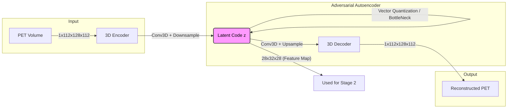
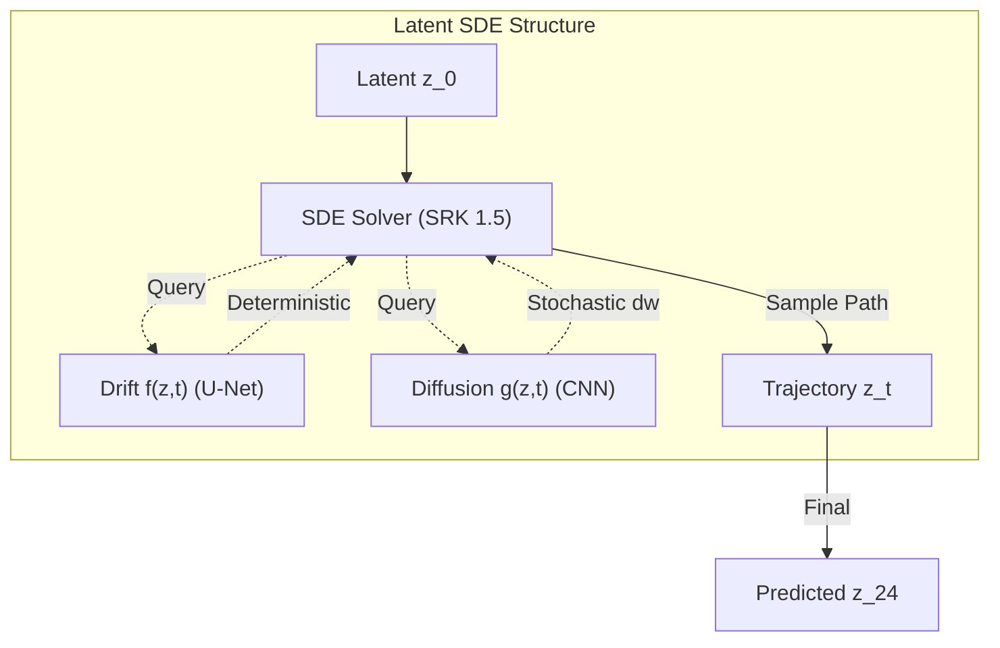

# Longitudinal PET Prediction with Neural ODE

[](https://www.python.org/)
[](https://pytorch.org/)
[](https://opensource.org/licenses/MIT)

> **Predict future PET scans from baseline using Neural ODEs, with robust handling of missing intermediate timepoints.**

---

## 📖 Overview

Predicting the progression of Alzheimer's Disease (AD) via longitudinal PET scans is critical for early diagnosis and treatment planning. This project implements a **Neural Ordinary Differential Equation (Neural ODE)** framework to predict future PET scans (e.g., at Month 24) from a baseline scan (Month 0).

A key challenge in longitudinal medical imaging is **missing data**. Patients often miss intermediate checkups (e.g., at Month 6, 12, or 18). Our model leverages the continuous-time modeling capabilities of Neural ODEs to naturally handle these irregular time intervals, integrating whatever data is available to refine the prediction trajectory.

### Key Features

- **Neural ODE**: Continuous-time dynamics modeling in latent space (Drift term)
- **Latent SDE**: Stochastic Differential Equation modeling (Drift + Diffusion)
- **Missing Data Handling**: Robust to variable available timepoints per subject
- **Disease Conditioning**: Optional conditioning on disease stage labels

### Architecture

#### Stage 1: Latent Representation Learning (AAE)
3D Adversarial Autoencoder compresses high-dimensional PET scans into a compact latent space.



#### Stage 2: Longitudinal Dynamics (Latent SDE)

Modeling the temporal evolution $z_0 	o z_{24}$ using **Stochastic Differential Equations** via `torchsde`. This unified framework captures both the deterministic trend (e.g., brain atrophy) and the stochastic variance of disease progression.

978531 dz_t = f(z_t, t)dt + g(z_t, t)dW_t 978531

*   **Drift $f(z,t)$**: Neural ODE (U-Net) modeling the mean trajectory.
*   **Diffusion $g(z,t)$**: Stochastic network modeling uncertainty.




### Technical Details

#### 1. Design Philosophy: Why this architecture?

*   **Why Latent Space?**
    *   **Efficiency**: 3D PET scans ($112 	imes 128 	imes 112$) are too computationally heavy for direct ODE integration. Compressing them to $28 	imes 32 	imes 28$ reduces memory usage by 64x, allowing for deeper dynamic networks.
    *   **Denoising**: The AAE effectively filters out high-frequency noise, strictly preserving structural metabolic patterns.

*   **Why U-Net for Drift ($f$)?**
    *   **Structure Preservation**: Disease progression in PET (e.g., Alzheimer's hypometabolism) is localized but structurally correlated. A U-Net backbone captures both local textures and global patterns via skip connections.

*   **Shared Architecture**:
    *   **Consistency**: Notably, both **Latent ODE** and **Latent SDE** share this **identical 3D U-Net** for the drift term ($f$). The SDE model simply adds a lightweight parallel branch ($g$) to model the variance, ensuring the core dynamics remain stable and comparable.

*   **Why Latent SDE?**
    *   **Uncertainty**: Disease progression is inherently stochastic. SDE introduces diffusion ($g$) that models the *variance* of progression, allowing us to estimate confidence intervals.


#### 2. Network Components

The system is built on two primary neural networks within the SDE framework:

1.  **Drift Network (f)**: The deterministic backbone.
    *   **Architecture**: 3D U-Net with time-conditioning and skip connections.
    *   **Role**: Predicts the anatomical evolution field $dz/dt$ (mean trend).
    *   **Input**: Latent state $z_t$ ($28 	imes 32 	imes 28$) and time $t$.

2.  **Diffusion Network (g)**: The stochastic branch.
    *   **Architecture**: Lightweight 3D CNN.
    *   **Role**: Estimates the pixel-wise noise intensity (variance).
    *   **Effect**: Allows sampling of diverse plausible trajectories for uncertainty quantification.

3.  **Solver (torchsde)**:
    *   **Method**: `srk` (Strong Runge-Kutta Order 1.5).
    *   **Function**: Integrates the Ito SDE $dz_t = f(z_t, t)dt + g(z_t, t)dW_t$.

## Installation

```bash
# Clone repository
git clone https://github.com/avalanchezy/IL-CLDM.git
cd IL-CLDM

# Create environment
conda create -n pet-ode python=3.11
conda activate pet-ode

# Install PyTorch (adjust for your CUDA version)
pip install torch torchvision torchaudio --index-url https://download.pytorch.org/whl/cu121

# Install dependencies (including torchdiffeq and torchsde)
pip install -r requirements.txt
```

## Data Preparation

### Directory Structure

```
IL-CLDM/
├── data/
│   └── {SubjectID}/
│       ├── *_ses-M00_*_pet.nii.gz    # Baseline (required)
│       ├── *_ses-M06_*_pet.nii.gz    # Month 6 (optional)
│       ├── *_ses-M12_*_pet.nii.gz    # Month 12 (optional)
│       └── *_ses-M24_*_pet.nii.gz    # Target (required)
├── data_info/
│   ├── data_info.csv                 # Labels: filename,label_id
│   ├── train.txt                     # Training subject IDs
│   ├── val.txt                       # Validation subject IDs
│   └── test.txt                      # Test subject IDs
└── result/                           # Checkpoints & logs
```

## Training

### Stage 1: Train AAE

```bash
# Train autoencoder
python main.py --train_aae

# Encode data to latent space
python main.py --enc_all

# Test reconstruction quality
python main.py --test_aae
```

### Stage 2: Train Prediction Model

```bash
# Train Latent SDE model (Recommended)
python train_ode.py --train --use_sde --data_root ./data

# (Optional) Train deterministic baseline
python train_ode.py --train --data_root ./data
```

> **Note**: The model automatically handles missing intermediate timepoints.
> When available, T6/T12/T18 scans are used to improve trajectory accuracy.

### Inference

```bash
# Test model
python train_ode.py --test --checkpoint result/exp/ODE_best.pth.tar

# Generate predictions
python train_ode.py --generate --checkpoint result/exp/ODE_best.pth.tar
```

## Model Variants

| Model | Description | Use Case |
|-------|-------------|----------|
| `LatentODE` | Pure Neural ODE | Fast, deterministic predictions, handles missing data |
| `LatentSDE` | Drift + Diffusion SDE | Best quality, uncertainty estimation |


## 🛠️ Configuration

Key hyperparameters can be adjusted in `config.py`:

- **`ode_hidden_dim`**: Complexity of the ODE derivative function.
- **`ode_solver`**: Solver method (e.g., `'dopri5'`, `'rk4'`). adaptive step solvers like `dopri5` are recommended.
- **`diffusion_steps`**: Number of denoising steps for the hybrid model.
- **`timepoints`**: Define the months to model (default: `[0, 6, 12, 18, 24]`).

## 🤝 Contributing

Contributions are welcome! Please open an issue or submit a pull request for any improvements.

1. Fork the Project
2. Create your Feature Branch (`git checkout -b feature/AmazingFeature`)
3. Commit your Changes (`git commit -m 'Add some AmazingFeature'`)
4. Push to the Branch (`git push origin feature/AmazingFeature`)
5. Open a Pull Request

## 📜 Citation

If you use this code in your research, please cite:

```bibtex
@misc{longitudinal-pet-ode,
  title={Longitudinal PET Prediction with Neural ODE},
  author={Your Name},
  year={2024},
  url={https://github.com/avalanchezy/IL-CLDM}
}
```

## 📄 License

Distributed under the MIT License. See `LICENSE` for more information.

---

*Built with PyTorch & torchdiffeq*
