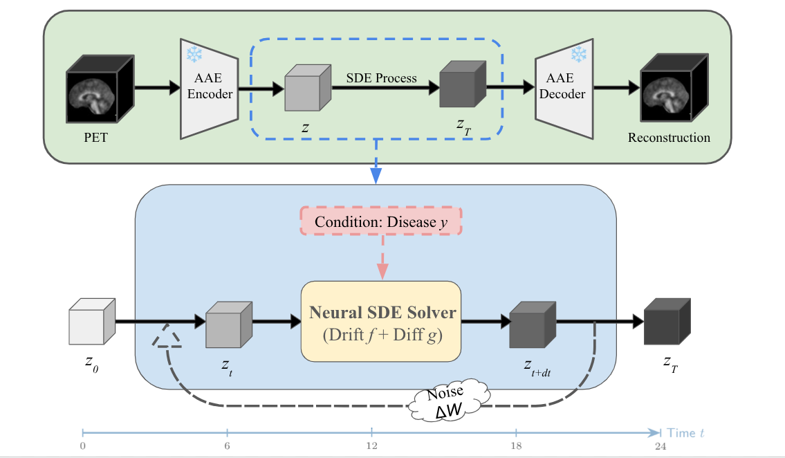

# Latent SDE for Longitudinal PET Prediction

[](https://www.python.org/)
[](https://pytorch.org/)
[](https://opensource.org/licenses/MIT)

> **Predict future brain PET scans from baseline using Neural Stochastic Differential Equations, with robust handling of missing intermediate timepoints and built-in uncertainty quantification.**

---

## 📖 Overview

Predicting the progression of Alzheimer's Disease (AD) via longitudinal PET imaging is critical for early diagnosis and treatment planning. However, two fundamental challenges exist:

1.  **Missing Data**: Patients frequently miss intermediate visits (Month 6, 12, or 18), resulting in irregular time series.
2.  **Uncertainty**: Disease progression is inherently stochastic — the same baseline can lead to different outcomes.

This project addresses both challenges with a **Latent SDE** framework that models disease trajectories as continuous-time stochastic processes.

---

## 🏗️ Framework



The system consists of two stages:

**Stage 1 (Green, top):** An Adversarial Autoencoder (AAE) compresses high-dimensional PET volumes ($1 \times 112 \times 128 \times 112$) into a compact latent representation $z$ ($8 \times 28 \times 32 \times 28$), achieving ~64x compression.

**Stage 2 (Blue/Yellow, bottom):** A **Neural SDE Solver** evolves the latent state $z_0$ forward along a continuous time axis ($t = 0 \to 6 \to 12 \to 18 \to 24$ months). The solver combines:
-   **Drift $f(z,t)$**: Predicts the *mean* trajectory (deterministic trend, e.g., brain atrophy patterns).
-   **Diffusion $g(z,t)$**: Predicts *noise intensity* (stochastic variance), enabling uncertainty quantification.
-   **Condition**: Disease stage label $y$ (CN/MCI/AD) conditions both $f$ and $g$.
-   **Noise**: Brownian motion $dW_t$ injected at each step, generating diverse sample paths.

The SDE being solved is:

$$dz_t = f(z_t, t; y)\,dt + g(z_t, t; y)\,dW_t$$

---

## ⚙️ Architecture & Parameter Specifications

### Network Components

| Component | Architecture | Key Parameters | Role |
|-----------|-------------|----------------|------|
| **Drift ($f$)** | 3D U-Net | 3 encoder/decoder blocks, 32→64→128 channels, skip connections, time+label conditioning | Predicts the anatomical evolution field $dz/dt$ (mean trajectory) |
| **Diffusion ($g$)** | 3D CNN | 3 conv layers (no pooling), Softplus output (ensures $g > 0$) | Estimates state-dependent noise intensity (uncertainty) |
| **AAE Encoder** | 3D Conv | Downsampling: $112^3 \to 28^3$ | Compresses PET to latent space |
| **AAE Decoder** | 3D ConvTranspose | Upsampling: $28^3 \to 112^3$ | Reconstructs PET from latent space |
| **Latent Space** | Compressed Grid | Shape: $1 \times 28 \times 32 \times 28$ (~64x compression) | Compact spatial representation |

### Why This Design?

-   **Drift uses U-Net**: Disease progression (e.g., hippocampal atrophy) is spatially structured. U-Net's skip connections preserve both local texture and global morphology simultaneously.
-   **Diffusion uses simple CNN**: Uncertainty estimation is smoother and lower-frequency than the trajectory itself. A lightweight network prevents training collapse (where $g \to 0$ or $g$ dominates $f$).
-   **Shared conditioning**: Both $f$ and $g$ receive the same time embedding (sinusoidal) and disease label embedding, ensuring stage-aware dynamics.

### Solver

| Parameter | Value | Rationale |
|-----------|-------|-----------|
| **Method** | `srk` (Strong Runge-Kutta 1.5) | Higher-order convergence for diagonal noise SDEs |
| **Step size** | `dt = 0.05` | Fixed step for stochastic stability |
| **Noise type** | Diagonal (Itô) | Each latent dimension has independent noise |

---

## 🚀 Installation

```bash
git clone https://github.com/avalanchezy/IL-CLDM.git
cd IL-CLDM

conda create -n pet-sde python=3.11
conda activate pet-sde

pip install torch torchvision torchaudio --index-url https://download.pytorch.org/whl/cu121
pip install -r requirements.txt
```

> **Key dependencies**: `torchsde` (SDE solver), `torchdiffeq` (ODE baseline), `nibabel` (NIfTI I/O)

---

## ⚡ Training

### Stage 1: Train AAE
```bash
python main.py --train_aae      # Train autoencoder
python main.py --enc_all        # Encode all data to latent .pt files
```

### Stage 2: Train Latent SDE
```bash
python train_ode.py --train --use_sde --data_root ./data
```

> **Note**: The model automatically handles missing intermediate timepoints via a **Jump mechanism**. When M06/M12/M18 scans are available, the SDE integrates segment-by-segment and fuses observations at each timepoint.

---

## 🧪 Quick Pipeline Test

Verify the entire pipeline (AAE → SDE → Decode) on 3 sample patients before full training:

```bash
# Train SDE on 010S0067 + 011S0010, test on 009S4612
python test_pipeline.py
```

**What it does:**
1. Loads the pre-trained AAE checkpoint
2. Encodes all PET scans (M00, M06, M12, M24) to latent space
3. Trains SDE for 200 epochs on 2 patients (with intermediate Jump updates)
4. Predicts M24 for the held-out patient from M00 only
5. Saves predicted/ground-truth NIfTI to `result/pipeline_test/`

**Expected output:**
```
Pipeline Test Summary
  AAE:          ✓ Loaded & working
  SDE Training: ✓ 200 epochs on ['010S0067', '011S0010']
  SDE Testing:  ✓ Predicted M24 for ['009S4612']
  Intermediates: ✓ M06/M12 used during training (Jump mechanism)
```

---

## 🔮 Inference

```bash
python train_ode.py --test --use_sde --checkpoint result/exp/ODE_best.pth.tar
python train_ode.py --generate --use_sde --checkpoint result/exp/ODE_best.pth.tar
```

---

## 🛠️ Configuration (`config.py`)

| Parameter | Default | Description |
|-----------|---------|-------------|
| `ode_hidden_dim` | 32 | Channel width of the Drift U-Net |
| `latent_dim` | 1 | Latent channels |
| `ode_solver` | `srk` | SDE solver algorithm |
| `learning_rate` | 1e-4 | Training learning rate |
| `ode_epochs` | 500 | Training epochs |

---

## 📜 Citation

```bibtex
@misc{latent-sde-pet,
  title={Latent SDE for Longitudinal PET Prediction},
  year={2024},
  url={https://github.com/avalanchezy/IL-CLDM}
}
```

## 📄 License

Distributed under the MIT License.
