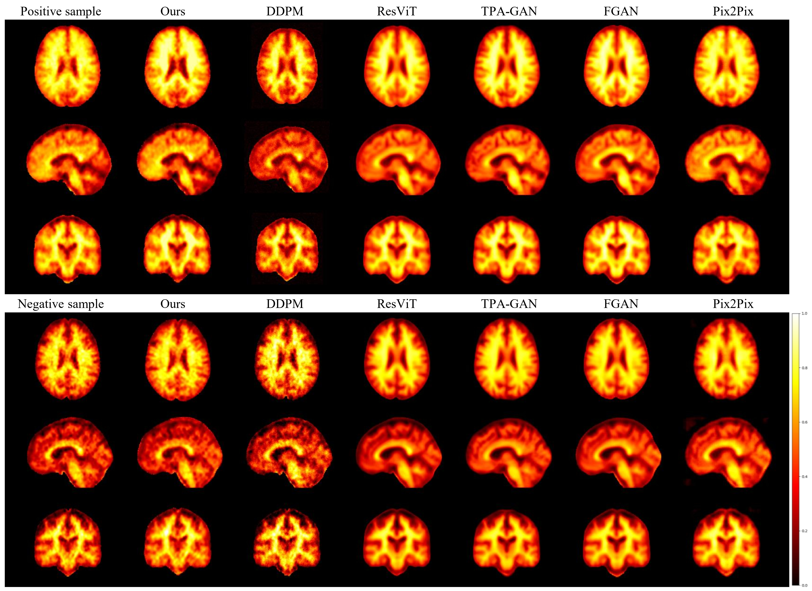

# IL-CLDM: Image-and-Label Conditioning Latent Diffusion Model

Synthesizing Aβ-PET from MRI for Detecting Amyloid Status

> **Original Paper**: Image-and-Label Conditioning Latent Diffusion Model: Synthesizing Aβ-PET from MRI for Detecting Amyloid Status

## 📋 Contents

1. [Model Overview](#-model-overview)
2. [Installation](#-installation)
3. [Data Preparation](#-data-preparation)
4. [Training](#-training)
5. [Results](#-results)
6. [Project Structure](#-project-structure)
7. [Contact](#-contact)
8. [License](#-license)

## 🧠 Model Overview


The **Image-and-Label Conditioning Latent Diffusion Model (IL-CLDM)** synthesizes Aβ-PET scans from MRI scans for classifying Aβ as positive or negative. The model uses a two-stage training approach:

### Two-Stage Training Pipeline

| Stage | Model | Description |
|-------|-------|-------------|
| **Stage 1** | AAE (Adversarial Autoencoder) | Compresses 3D PET images into a latent space |
| **Stage 2** | LDM (Latent Diffusion Model) | Conditional generation in latent space with MRI + Label guidance |

## 🔧 Installation

### Requirements
- Python >= 3.8
- PyTorch >= 2.0.0
- CUDA >= 11.8 (recommended)

### Setup

```bash
# Clone the repository
git clone https://github.com/avalanchezy/IL-CLDM.git
cd IL-CLDM

# Create conda environment
conda create -n il-cldm python=3.11
conda activate il-cldm

# Install PyTorch (adjust for your CUDA version)
pip install torch torchvision torchaudio --index-url https://download.pytorch.org/whl/cu121

# Install dependencies
pip install -r requirements.txt
```

## 📁 Data Preparation

### 1. Download ADNI Dataset
Download the ADNI dataset from [here](https://adni.loni.usc.edu/data-samples/access-data/).

### 2. Directory Structure
```
IL-CLDM/
├── data/
│   ├── process/
│   │   ├── whole_Abeta_112/    # Preprocessed Aβ-PET images (112×128×112)
│   │   └── whole_MRI_112/      # Preprocessed MRI images (112×128×112)
│   ├── latent_Abeta/
│   │   └── latent_Abeta_112/   # Generated by encoding step
│   └── syn_Abeta/              # Synthesized PET outputs
├── data_info/
│   ├── data_info.csv           # Labels (filename, label_id columns)
│   ├── train.txt               # Training IDs (e.g., '037S6046.nii.gz')
│   ├── val.txt                 # Validation IDs
│   └── test.txt                # Test IDs
└── result/                     # Checkpoints and logs
```

### 3. Data Info Format

**data_info.csv**:
```csv
filename,label_id
002S4521.nii.gz,0
016S4688.nii.gz,1
...
```

**train.txt / val.txt / test.txt**:
```
002S4521.nii.gz
016S4688.nii.gz
...
```

## 🚀 Training

### Configuration
Edit `config.py` to set hyperparameters:

```python
device = "cuda:0"          # GPU device
epochs = 1000              # Training epochs
batch_size = 2             # Batch size
num_classes = 4            # Number of classes (NC, MCI, AD, etc.)
image_size = 28            # Latent space size (112/4)
```

### Stage 1: Train AAE

```bash
# Train the Adversarial Autoencoder
python main.py --train_aae

# Encode training data to latent space
python main.py --enc
```

### Stage 2: Train LDM

```bash
# Train the Latent Diffusion Model
python main.py --train_ldm
```

### Generation

```bash
# Generate synthetic PET images
python main.py --gen
```

### All Available Commands

| Command | Description |
|---------|-------------|
| `--train_aae` | Train the AAE model |
| `--test_aae` | Test the trained AAE |
| `--enc` | Encode training data using AAE |
| `--enc_test` | Encode test data using AAE |
| `--train_ldm` | Train the LDM model |
| `--gen` | Generate synthetic PET images |

## 📊 Results



Comparison of synthesized Aβ-PET images from our IL-CLDM model and other competitive methods.

## 📂 Project Structure

```
IL-CLDM/
├── config.py       # Configuration and hyperparameters
├── dataset.py      # Dataset classes (OneDataset, TwoDataset)
├── main.py         # Main training/testing entry point
├── model.py        # Model architectures (AAE, UNet, Diffusion)
├── utils.py        # Helper functions
├── requirements.txt # Python dependencies
└── README.md       # This file
```

### Key Components in `model.py`
- **Encoder/Decoder**: 3D convolutional autoencoder
- **AAE**: Adversarial Autoencoder with discriminator
- **UNet**: Noise prediction network with time/label embeddings
- **EMA**: Exponential Moving Average for stable training

## 📧 Contact

If you have any questions, please open an issue or contact:
- Original authors: ouzx2022@shanghaitech.edu.cn

## 📄 License

This repository is licensed under the MIT License.
