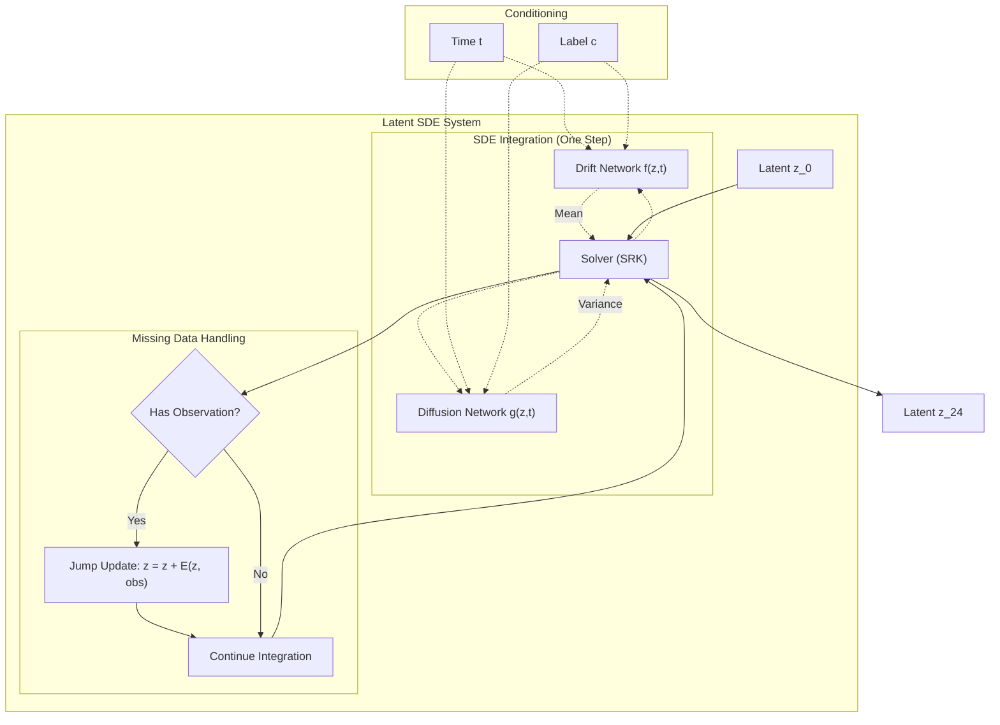

# Latent SDE for Longitudinal PET Prediction

[](https://www.python.org/)
[](https://pytorch.org/)
[](https://opensource.org/licenses/MIT)

> **Predict future PET scans using Stochastic Differential Equations (SDEs), utilizing latent dynamics to robustly handle missing intermediate data.**

---

## 📖 Overview

Predicting the progression of Alzheimer's Disease (AD) is challenging due to the stochastic nature of neurodegeneration and irregular visit intervals. This project implements a **Latent SDE** framework that treats the disease trajectory as a continuous stochastic process.

By combining a **Neural ODE drift term** (modeling the mean trend) with a **Diffusion term** (modeling uncertainty), our model captures the full distribution of possible futures. Crucially, it incorporates a **Jump Mechanism** to update its state whenever intermediate real data (e.g., Month 6, 12) is available, ensuring predictions remain improved by all available evidence.

### Key Features

- **True Latent SDE**: Solves $dz_t = f(z,t)dt + g(z,t)dw_t$ via `torchsde`.
- **Uncertainty Quantification**: Implicitly models variance in disease progression.
- **Missing Data Handling**: Continuous-time integration handles irregular sampling; Jump mechanism incorporates sparse observations.
- **Disease Conditioning**: Dynamics conditioned on clinical labels (CN, MCI, AD).

---

## 🏗️ Architecture

The system operates in a compressed latent space ($28 \times 32 \times 28$) learned by an Adversarial Autoencoder (AAE). The core dynamic model is the **Latent SDE**.

### Unified SDE Framework

The model integrates the latent state from $t=0$ to $t=T$ (Month 24).



### Technical Components

1.  **Drift Network ($f$)**: 
    *   **Backbone**: 3D U-Net with skip connections.
    *   **Role**: Predicts the anatomical evolution field (e.g., atrophy patterns).
    *   **Shared**: This same backbone is used for both deterministic (ODE) and stochastic (SDE) modes.

2.  **Diffusion Network ($g$)**:
    *   **Backbone**: Lightweight 3D CNN.
    *   **Role**: Estimates state-dependent diffusion coefficients (diagonal noise).
    *   **Effect**: Allows the path to deviate stochastically from the mean, capturing biological variance.

3.  **Solver**:
    *   Uses **Strong Runge-Kutta (SRK 1.5)** method for high-order stochastic integration.

---

## 🚀 Installation

```bash
# Clone repository
git clone https://github.com/avalanchezy/IL-CLDM.git
cd IL-CLDM

# Create environment
conda create -n pet-ode python=3.11
conda activate pet-ode

# Install PyTorch (adjust for your CUDA version)
pip install torch torchvision torchaudio --index-url https://download.pytorch.org/whl/cu121

# Install dependencies (including torchsde)
pip install -r requirements.txt
```

---

## 📊 Data Preparation

Directory Structure:
```
IL-CLDM/
├── data/
│   └── {SubjectID}/
│       ├── *_ses-M00_*_pet.nii.gz    # Baseline
│       ├── *_ses-M06_*_pet.nii.gz    # (Optional)
│       └── *_ses-M24_*_pet.nii.gz    # Target
├── data_info/
│   ├── data_info.csv
│   └── train.txt / val.txt / test.txt
└── result/
```

---

## ⚡ Training

### Stage 1: Latent Representation (AAE)

Before training the SDE, you must train the Autoencoder to learn the latent space.

```bash
# 1. Train AAE
python main.py --train_aae

# 2. Encode all data to latent .pt files
python main.py --enc_all
```

### Stage 2: Latent SDE

Train the stochastic dynamic model.

```bash
# Train Latent SDE (Recommended)
python train_ode.py --train --use_sde --data_root ./data
```

> **Note**: The baseline deterministic ODE can still be trained by removing `--use_sde`.

---

## 🔮 Inference

```bash
# Test model performance (PSNR/SSIM)
python train_ode.py --test --checkpoint result/exp/ODE_best.pth.tar

# Generate NIfTI predictions
python train_ode.py --generate --checkpoint result/exp/ODE_best.pth.tar
```

---

## 🛠️ Configuration

Key settings in `config.py`:

*   **`ode_solver`**: Algorithm for integration (e.g., `'srk'` for SDE, `'dopri5'` for ODE).
*   **`latent_dim`**: Channels in latent space (default: 8).
*   **`ode_hidden_dim`**: Channel width for the Drift U-Net (default: 32).

---

## 📜 Citation

```bibtex
@misc{latent-sde-pet,
  title={Latent SDE for Longitudinal PET Prediction},
  year={2024},
  url={https://github.com/avalanchezy/IL-CLDM}
}
```

## 📄 License

Distributed under the MIT License.
