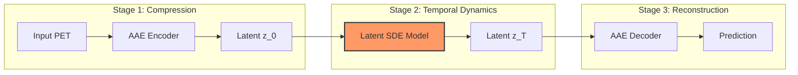
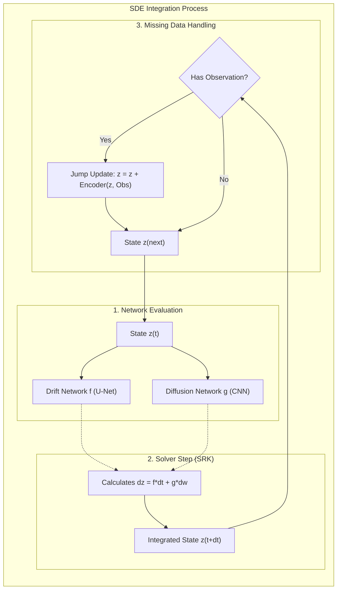

# Latent SDE for Longitudinal PET Prediction

[](https://www.python.org/)
[](https://pytorch.org/)
[](https://opensource.org/licenses/MIT)

> **Predict future PET scans using Stochastic Differential Equations (SDEs), utilizing latent dynamics to robustly handle missing intermediate data.**

---

## 🏗️ System Architecture

### 1. High-Level Pipeline (Complete View)

The system transforms high-dimensional PET scans into a compact latent space, models their specific temporal evolution using an SDE, and reconstructs the future state.



### 2. Latent SDE Architecture (Specific Detail)

Inside the `Latent SDE Model` block, we solve the equation $dz_t = f(z,t)dt + g(z,t)dw_t$.



---

## ⚙️ Architecture & Parameter Specifications

### SDE Components

| Component | Architecture | Specification | Rationale |
|-----------|--------------|---------------|-----------|
| **Drift ($f$)** | **3D U-Net** | • **3 Encoder Blocks** (Conv3D-GN-Swish)<br>• **Channels**: 32 (Base) $\to$ 64 $\to$ 128<br>• **Conditions**: Time ($sin$ emb) + Label (learned emb) | A U-Net captures multi-scale features. High-res path preserves texture (local metabolism), low-res path captures global atrophy structure. |
| **Diffusion ($g$)** | **3D CNN** | • **3 Conv Blocks** (No pooling)<br>• **Output**: Softplus (positive noise scale) | Diffusion needs to be spatially adaptive (e.g., higher uncertainty in ventricles) but simpler than Drift. A shallow CNN is sufficient and stable. |
| **Latent Space** | **Compressed Grid** | • **Shape**: $8 \times 28 \times 32 \times 28$<br>• **Compression Ratio**: ~64x | Direct voxel-wise ODE is intractable. $28^3$ is the "sweet spot" retaining structure while allowing extensive temporal computation. |

### Solver Configuration

*   **Algorithm**: `srk` (Strong Runge-Kutta Order 1.5).
    *   *Why?* Standard Euler-Maruyama (Order 0.5/1.0) is too imprecise for image generation. SRK offers better convergence for diagonal noise.
*   **Step Size**: Fixed `dt=0.05`.
    *   *Why?* Stochastic solvers often struggle with adaptive steps. A fixed fine-grained step ensures stability.

---

## 📖 Overview

Predicting the progression of Alzheimer's Disease (AD) via longitudinal PET scans is critical for early diagnosis. This project leverages continuous-time **Neural SDEs** to model patient trajectories even with **missing intermediate visits**.

### Key Features
- **Uncertainty Quantification**: Implicitly models variance via the diffusion term.
- **Robustness**: Handles sparse data (e.g., missing Month 6 scan) naturally via continuous integration.

---

## 🚀 Installation

```bash
git clone https://github.com/avalanchezy/IL-CLDM.git
cd IL-CLDM

conda create -n pet-ode python=3.11
conda activate pet-ode

pip install torch torchvision torchaudio --index-url https://download.pytorch.org/whl/cu121
pip install -r requirements.txt
```

---

## ⚡ Training

### 1. Train AAE (Compression Stage)
```bash
python main.py --train_aae
python main.py --enc_all
```

### 2. Train Latent SDE (Dynamics Stage)
```bash
python train_ode.py --train --use_sde --data_root ./data
```

---

## 🔮 Inference

```bash
# Generate predictions
python train_ode.py --generate --checkpoint result/exp/ODE_best.pth.tar
```

---

## 🛠️ Configuration (config.py)
*   `ode_hidden_dim`: 32 (Width of U-Net)
*   `latent_dim`: 8 (Channels in latent space)
*   `learning_rate`: 1e-4

## 📜 Citation
```bibtex
@misc{latent-sde-pet,
  title={Latent SDE for Longitudinal PET Prediction},
  year={2024},
  url={https://github.com/avalanchezy/IL-CLDM}
}
```
